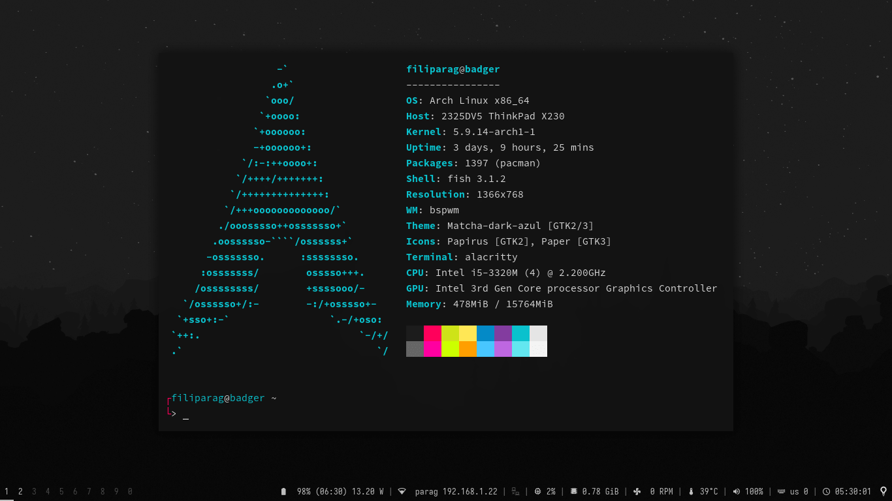

# Dotfiles for Arch Linux

## Preview



## Installation

### Automated installation from scratch

#### Prerequisites
- booted into *UEFI*
[live environment](https://wiki.archlinux.org/index.php/Installation_guide#Boot_the_live_environment)
- a hard drive ready to be completely wiped
- access to the internet

#### Steps
```bash
# Download standalone base system installer script
curl -LO 'https://dotfiles.filiparag.com/install-system.sh'

# Run interactive installer with preselected dotfiles option
sh install-system.sh -d yes

# Reboot the computer and eject installation media
reboot

# After logging in, install dotfiles using the bootstrapper script
dotfiles-install

# Make desired hardware-specific modifications outlined below

# Reboot your system once again to ensure changes are applied properly
reboot
```

### With an existing system

#### Prerequisites
- [base Arch Linux](https://wiki.archlinux.org/index.php/Installation_guide) installed
- at least 8 GiB of free space on root partition
- user account with [`sudo`](https://wiki.archlinux.org/index.php/Sudo#Example_entries) privileges
- access to the internet

#### Steps
```bash
# Clone dotfiles repository
git clone https://github.com/filiparag/dotfiles.git && cd dotfiles

# Run automatic installer
./install-dotfiles.sh

# Hardware-specific commands go here

# Reboot your system to apply all modifications
reboot
```
Existing conflicting configuration files will be placed into `~/.sydf/.old` directory.

## Usage and customization

### Keyboard shortcuts

Shortcuts manual: [`~/.sydf/SHORTCUTS.md`](./SHORTCUTS.md)

Shortcut configuration is in [`~/.config/sxhkd/sxhkdrc`](./home/filiparag/.config/sxhkd/sxhkdrc)

### Configuring the environment

Window manager configuration ([wmrc](https://github.com/filiparag/wmrc/)):
[`~/.config/wmrc/rc.conf`](./home/filiparag/.config/wmrc/rc.conf)

Startup applications and daemons are listed in `APPS` variable in
[`~/.config/wmrc/modules/services/apps`](./home/filiparag/.config/wmrc/modules/services/apps)

User-specific environment variables:
[`~/.config/fish/conf.d/user.fish`](./home/filiparag/.config/fish/conf.d/user.fish)

Git configuration: [`~/.gitconfig`](./home/filiparag/.gitconfig)

Wallpaper and lockscreen images are located in `~/Pictures` directory

To set default monitor setup, create desired layout using `arandr`
and save it as `~/.screenlayout/Default.sh`

### Security and remote access

By default, all incoming network traffic is blocked except for:
- *SSH*: port `22/TCP` with public key authentication only
- *Syncthing*: ports `22000/TCP` and `21027/UDP`

To enable [VNC server](https://wiki.archlinux.org/index.php/TigerVNC), run:
``` bash
# Set VNC password
vncpasswd

# Allow incoming VNC connections
sudo ufw allow in 5900/tcp

# Restart wmrc VNC module
wmrc -r 'services/vnc(start)'
```

### Hardware-specific modifications

#### Xorg video drivers

If you are using Nvidia GPU:

- install appropriate [`xf86-video-`](https://wiki.archlinux.org/index.php?title=Xorg#Driver_installation) driver
- make sure you have proper configuration file in [`/etc/X11/xorg.conf.d/`](./etc/X11/xorg.conf.d/)

#### Battery life optimization

Provided [TLP](https://wiki.archlinux.org/index.php/TLP) configuration file
is optimized for ThinkPad X230: [`/etc/tlp.conf`](./etc/tlp.conf)

To enable it, run:
```bash
# Install
sudo pacman -S tlp

# Run at startup as a service
sudo systemctl enable tlp.service

# Start immediately
sudo tlp start
```
